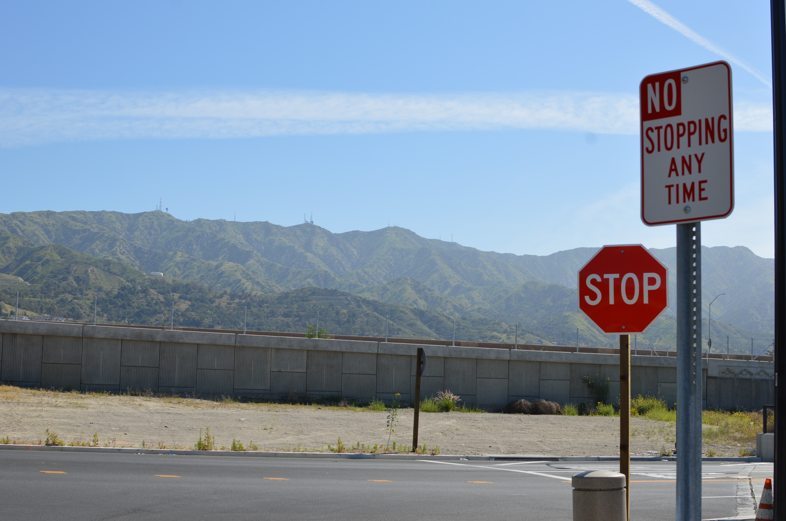

# Analysis of Terry Stops in Seattle
Flat Iron Data Science Project - Phase 3
 
         
<!---Photo by Kevork Kurdoghlian on Unsplash--->       
<!---Photo by <a href="https://unsplash.com/@pedroplus?utm_source=unsplash&amp;utm_medium=referral&amp;utm_content=creditCopyText">Pedro da Silva</a> on <a href="https://unsplash.com/s/photos/stop-sign?utm_source=unsplash&amp;utm_medium=referral&amp;utm_content=creditCopyText">Unsplash</a>--->
Prepared and Presented by:  **_Melody Peterson_**  
[Presentation PDF](https://github.com/melodygr/Classification_Project/blob/main/Terry%20Stop%20Presentation.pdf "Presentation PDF")

### Business Problem    
A Terry stop in the United States allows the police to briefly detain a person based on reasonable suspicion of involvement in criminal activity. Reasonable suspicion is a lower standard than probable cause which is needed for arrest. When police stop and search a pedestrian, this is commonly known as a stop and frisk. When police stop an automobile, this is known as a traffic stop. If the police stop a motor vehicle on minor infringements in order to investigate other suspected criminal activity, this is known as a pretextual stop. - [Wikipedia](https://en.wikipedia.org/wiki/Terry_stop#:~:text=A%20Terry%20stop%20in "Terry Stop Definition")

This classification project attempts to determine the possible demographic variables that determine the outcome of a Terry stop.

### Data    
This data represents records of police reported stops under Terry v. Ohio, 392 U.S. 1 (1968). 
The dataset was created on 04/12/2017 and first published on 05/22/2018 and is provided by the city of Seattle, WA.
There were 45,317 rows and 23 variables
Classification target is ‘Arrest Flag’
Initial ‘Arrest Flag’ distribution  ‘N’ - 42585, ‘Y’ - 2732

### Modeling Process
Following the OSEMN (Obtain, Scrub, Explore, Model, Interpret) data science framework, we began with an understanding of our business problem and the acquisition of data.  We then followed an iterative process of cleaning and exploring the data, checking for issues with modeling assumptions, creating and testing a model, interpreting the model, and reevaluating the data.

In the initial data exploration, after subsetting the data to the top zipcodes, we checked the distributions of the independent variables for normal distributions.  Although it is not required for the data to be distributed normally, it can result in better models and predictions.

As part of the data cleaning/scrubbing phase, we checked for duplicates, and treated place holder values and missing values in ways to best retain as much data as possible while keeping the integrity of the data.  We also checked for multicollinearity among the independent variables and found several variables with high correlations, including: sqft living/sqft above, sqft living/grade, sqft living 15/sqft living, grade/sqft above, bathrooms/sqft living.

Once the data had been cleaned we further explored by looking at plots of the data for linear relationships, normal distributions, and skew caused by outliers.  Many of the variables appeared to be skewed by abnormally high outliers. We used IQR to remove price outliers from the dataset before our train test split.

After creating an initial baseline model, several of the continuous variables were log transformed and scaled to make them more normally distributed and comparable to each other.
 

We then iterated through the modeling process, interpreting our results after each model, and making changes and adjustments based on statistical significance of the variables.  For our final model, you can see in this graph how our predictions match up with the actual data on which we trained the model as well as on predicting the test data value for Sale Price.

By holding all variables except one constant at their mean, we can visualize the relationship between sale price and any given variable as predicted by our model.

### Conclusions  
* Analysis of misclassified data
* 
* 

### Next Steps / Future Work  
1. Further analyze unknown or missing values
1. Update ‘Arrest Flag’ with arrest values from ‘Stop Resolution’
1. Try no SMOTE
1. Tune Support Vector Classification

